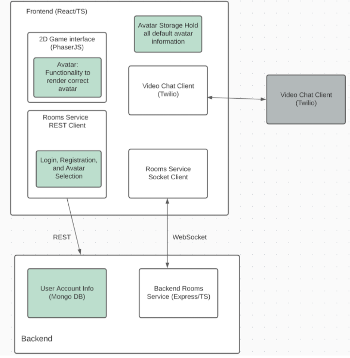

# Covey.Town

Covey.Town provides a virtual meeting space where different groups of people can have simultaneous video calls, allowing participants to drift between different conversations, just like in real life.

This version of Covey.Town has been modified and updated as a final project for team 43 to allow users to select different avatars.

The figure below depicts a very high level architecture view of Covey.Town, where white and grey elements are from the original Covey.Town and green elements were those added for the implementation of the avatar feature. A more detailed overview of the design can be found in the DESIGN.md file.

The frontend client (in the `frontend` directory of this repository) uses the [PhaserJS Game Library](https://phaser.io) to create a 2D game interface, using tilemaps and sprites. The classes related to phaser were modified to support the use of various avatars instead of a single default.  

The frontend implements video chat using the [Twilio Programmable Video](https://www.twilio.com/docs/video) API, and that aspect of the interface relies heavily on [Twilio's React Starter App](https://github.com/twilio/twilio-video-app-react).

A backend service (in the `services/roomService` directory) implements the application logic: tracking which "towns" are available to be joined, and the state of each of those towns.

## Running this app locally

There are a few steps that need to be completed to allow the application to run locally:

### Setting up the backend

#### 1. Create .env with Twilio information

To run the backend, you will need a Twilio account. Twilio provides new accounts with $15 of credit, which is more than enough to get started.
To create an account and configure your local environment:

1. Go to [Twilio](https://www.twilio.com/) and create an account. You do not need to provide a credit card to create a trial account.
2. Create an API key and secret (select "API Keys" on the left under "Settings")
3. Create a `.env` file in the `services/roomService` directory, setting the values as follows:

| Config Value            | Description                               |
| ----------------------- | ----------------------------------------- |
| `TWILIO_ACCOUNT_SID`    | Visible on your twilio account dashboard. |
| `TWILIO_API_KEY_SID`    | The SID of the new API key you created.   |
| `TWILIO_API_KEY_SECRET` | The secret for the API key you created.   |
| `TWILIO_API_AUTH_TOKEN` | Visible on your twilio account dashboard. |

#### 2. Install dependencies

If this is the first time you're running this app locally, you'll need to run `npm install` while in the `services/roomService` directory. This will install all necessary dependencies in the app.

If npm install has already been run, this step can be skipped.

#### 3. Start backend server

Once the above steps have been completed, the server is ready to run. 

While in the `services/roomService` directory, run the `npm start` command to start the server. If everything worked correctly, you should see a commandline output like: `Listening on 4000`. 

### Setting up the frontend

#### 1. Create .env with local server information

Navigate to the `/frontend` directory. Create a new `.env` file with the following line: REACT_APP_TOWNS_SERVICE_URL=http://localhost:4000

This tells the frontend where to send requests to the backend and allows the frontend to communicate. without the correct SERVICE_URL, all the requests from the frontend will get rejected.

#### 2. Install dependencies

If this is the first time you're running this app locally, you'll need to run `npm install` while in the `/frontend` directory. This will install all necessary dependencies in the app.

If npm install has already been run, this step can be skipped.

#### 3. Start frontend

Once the above steps have been completed, the frontend of the app is ready to run. 

While in the `/frontend` directory, run the `npm start` command to start the app. If everything worked correctly, then a new tab in your default browser will open and load the app.

The online deployment of this app can be found at:

https://master--inspiring-bell-3080b7.netlify.app/
